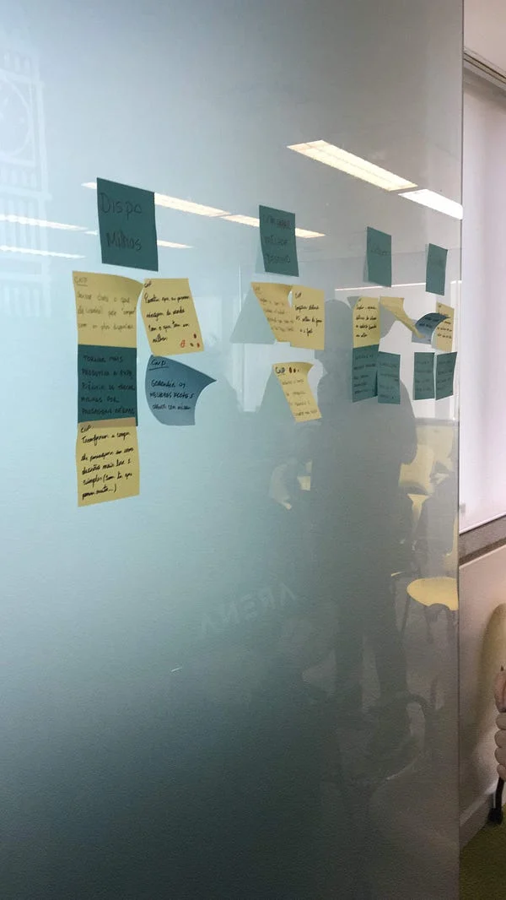
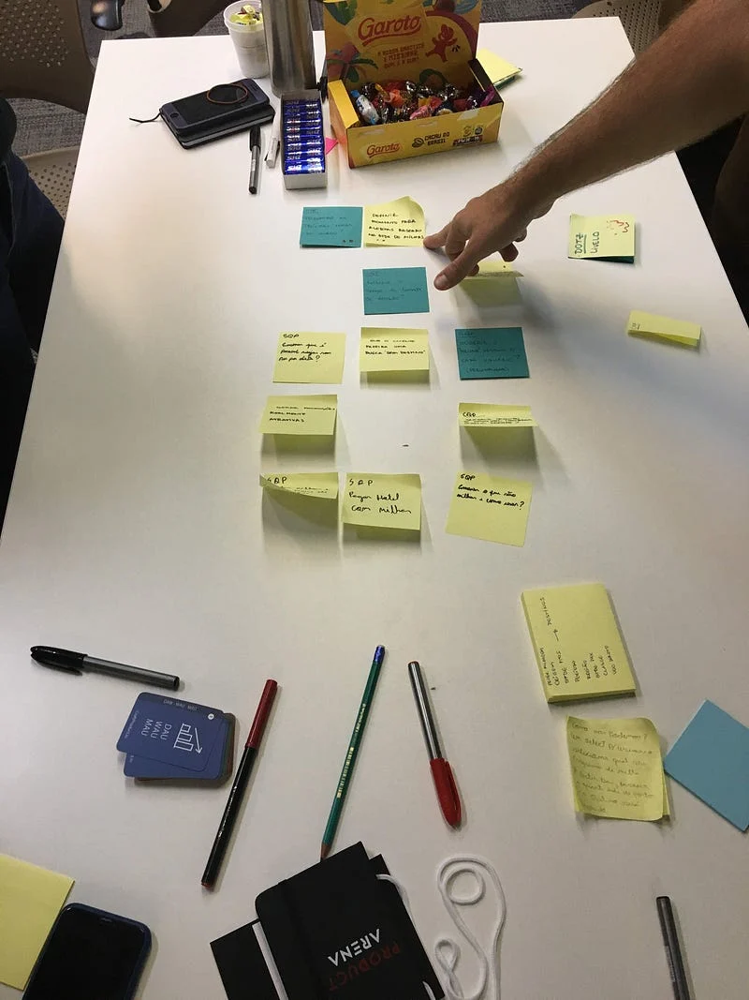
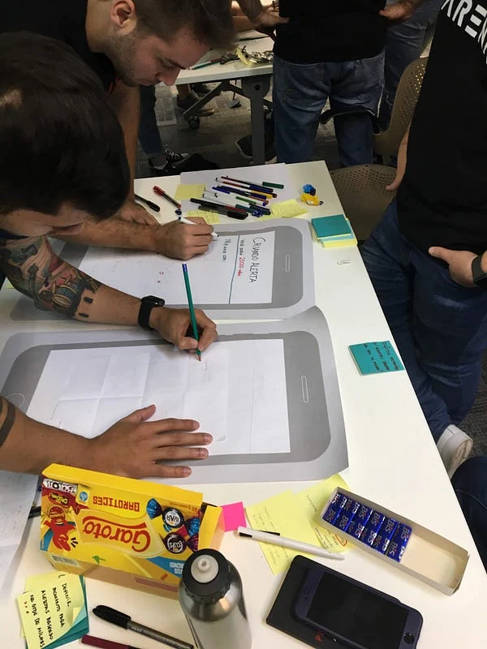
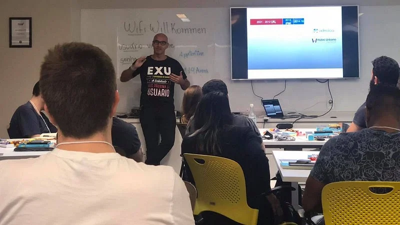
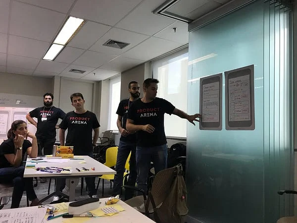

No último final de semana (1 e 2/9) participei do 14º _Product Manager_ da _Product Arena_ com [Horácio Soares](https://medium.com/u/9a8a5b6f1785) e [Arthur Castro](https://medium.com/u/990e7599ce69).

No curso você tem um _overview_ sobre as responsabilidades de um PM, além de ser apresentado à metodologia _Design Sprint_ e assuntos como Métricas, User Research \\o/ e Liderança de Produto, tudo em um misto de teoria com mão na massa.

Aplicamos cada assunto no problema que o time escolheu para solucionar. No caso escolhemos a dor de um dos integrantes, que era a possibilidade de escolher uma viagem apenas passando a quantidade de milhas, origem e quantidade de dias, o que é bem diferente das formas como se busca viagem atualmente.

Algumas etapas do processo:

À esquerda temos post-its de CNP (Como nós podemos?) e na direita SQP (Será que podemos?)

Protótipos da solução encontrada.

PM fica na intersecção entre _UX_ e _Business_, onde tem que se manter o equilíbrio, nenhum dos lados pode pender demais, senão o produto pode quebrar. A palavra achismo não existe, tudo deve ser orientado a teste, validações e métricas daquilo que é importante para o produto. Além dos números, testes, métricas, PM também tem que liderar pessoas e passar a visão do produto a elas.

Além do conteúdo do curso, que é ótimo, as experiências de acertos e erros do Arthur e do Horácio ajudam a entender que nada é bala de prata, que tudo pode/deve ser adaptado dependendo do contexto do seu produto.

Galera reunida para a foto.

À esquerda Horácio falando sobre sua trajetória profissional e na direita meu grupo apresentando a solução para o problema.

Recomendo muito para quem quer entrar no mundo de produto fazer o curso, valeu cada minuto.
