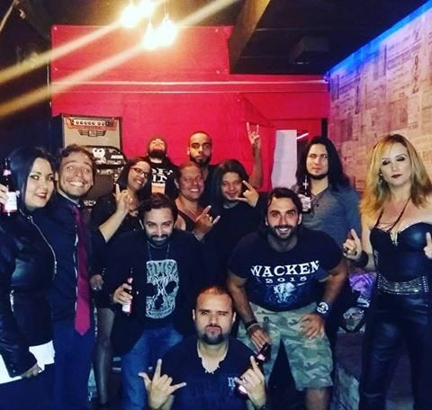

Bom, antes de mais nada quero agradecer ao meu Brother [Victor Alves](https://www.instagram.com/victoralvesmusic/), por ter me acompanhado nessa caminhada, valeu mesmo ❤

Há umas duas semanas que vi uma publicação sobre [**A Voz do Rock**](http://manifestobar.com.br/avozdorock2017/)**,** e acabei gravando um vídeo com a música Unbreakable da Banda Stratovarius — tenho esse e outro cover no [**SoundCloud**](https://soundcloud.com/bomfim-junior/sets/covers) —, não criei muitas expectativas de que iria ser classificado para a primeira eliminatória. Eis que no sábado, dia 14, recebo um e-mail informando que eu havia sido escolhido para a primeira eliminatória, fiquei sem saber o que pensar, mas agora era o momento de achar a música, tarefa essa muito difícil.

Ouço muito Kamelot, Angra e Hangar, mas muitas das músicas não tinham *playbacks* no YouTube :(, quase no limite de enviar a música, escolhi Nova Era do Angra, foi *feeling* total a escolha dela, apesar de gostar muito dessa música, eu sabia que seria um desafio enorme cantá-la. Dias antes da eliminatória, a euforia só aumentava.

Enfim chegou o grande dia, a eliminatória. No domingo eu estava até que bem tranquilo para quem iria subir em um palco pela primeira vez. Uma curiosidade é o ouvido sobre-humano do [**Nando Fernandes**](https://www.facebook.com/nando.fernandes.3), o cara ajustando os retornos do palco, foi muito mito. No palco tudo certo, e foram nos chamando para testar os *playbacks*, fui o último a subir com um frio na barriga. *Playback* testado, era a hora de esperar o momento da apresentação.

Fui o último a subir ao palco, isso foi engraçado, pois meu sobrenome é Bomfim, achei que tivesse sido uma zoeira da produção, mas não, saí em último no sorteio mesmo *hahaha*. Além disso, tive a oportunidade de ouvir e aprender com as vozes potentes de cada um dos novos amigos que ali fiz, uma mais foda que a outra. Aqueles momentos antes da apresentação foram demais, conversamos muito, trocamos experiências e demos muitas risadas.

Chegado o momento, subi ao palco, sendo chamado por Nando Fernandes, que foi uma baita honra. Me apresentei, mas já sabia que não tinha entregado uma boa apresentação, estava tão tranquilo/nervoso que isso me atrapalhou muito. Mesmo assim, gostei bastante de subir ao palco e ter me apresentado, aprendi muito.

O que levo desse dia foram os novos amigos e a experiência de uma apresentação, que me mostrou no que devo focar daqui para frente.

Fotos com os novos amigos

A foto com o CARA, Nando Fernandes

Recentemente ouvindo uma das músicas do Hangar, escolhi uma frase, que reflete bem tudo isso.

> It's Just The Beginning

Agradeço a cada um que me ajudou até aqui. \\o/. Let's Rock
